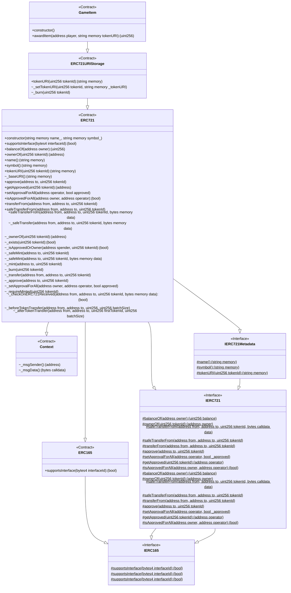

<h1 align="center">Welcome to solidity-mermaid 👋</h1>
<p>
  <a href="https://codecov.io/github/ernestognw/solidity-mermaid" > 
     
  </a>
  
  <a href="https://github.com/ernestognw/solidity-mermaid#readme" target="_blank">
    
  </a>
  <a href="https://github.com/ernestognw/solidity-mermaid/graphs/commit-activity" target="_blank">
    
  </a>
  <a href="https://github.com/ernestognw/solidity-mermaid/blob/master/LICENSE" target="_blank">
    
  </a>
</p>

> A Solidity AST parser that allows to convert smart contracts into Github's Mermaid.js language for diagramming.

[Solidity](https://docs.soliditylang.org/en/latest/index.html) is an object-oriented, high-level language for implementing smart contracts on top of the Ethereum Virtual Machine, while [Mermaid](https://mermaid.js.org/) is a Javascript library for diagramming that includes support for [Class Diagrams](https://mermaid.js.org/syntax/classDiagram.html).

This package aims to be a tool to produce Mermaid definitions from Solidity code, which can be useful for high-level representations, usefulf for audits and security assesment or just putting them on your generated docs. See [solidity-docgen](https://github.com/OpenZeppelin/solidity-docgen).

Take for example the following Solidity code:

```solidity
// contracts/GameItem.sol
// SPDX-License-Identifier: MIT
pragma solidity ^0.8.0;

import "@openzeppelin/contracts/token/ERC721/extensions/ERC721URIStorage.sol";
import "@openzeppelin/contracts/utils/Counters.sol";

contract GameItem is ERC721URIStorage {
    using Counters for Counters.Counter;
    Counters.Counter private _tokenIds;

    constructor() ERC721("GameItem", "ITM") {}

    function awardItem(address player, string memory tokenURI)
        public
        returns (uint256)
    {
        uint256 newItemId = _tokenIds.current();
        _mint(player, newItemId);
        _setTokenURI(newItemId, tokenURI);

        _tokenIds.increment();
        return newItemId;
    }
}
```

It will output the following representation:



## Getting started

```
npm install solidity-mermaid
```

### Getting a Solc Output

In order to get a Solc output, you can use a compilation artifact from your common development enviroment (such as [Hardhat](https://github.com/NomicFoundation/hardhat) or [Foundry](https://github.com/foundry-rs/foundry/))

If not, you can always get the output from scratch using [solc-js](https://github.com/ethereum/solc-js):

```js
import solc from "solc";

const input = {
  language: "Solidity",
  sources: {
    "path/to/your/file.sol": {
      content: `
        // SPDX-License-Identifier: MIT

        ...

        contract Example is ... {
          ...
        }
      `,
    },
  },
  settings: {
    outputSelection: {
      "*": {
        "*": ["*"],
        "": ["ast"],
      },
    },
  },
};

const output = JSON.parse(solc.compile(JSON.stringify(input)));
```

### Solidity AST to Class Diagram

To get a class diagram from your output, you'll need to pass the output, and an AST node with its type and id:

```js
const classDiagram = new Class(output, "ContractDefinition", typeDef.id);

// First run you'll need to use `processed` so the AST gets converted into text
console.log(classDiagram.processed);

// Afterwards, if no changes were made to the AST, you can just print its text
console.log(classDiagram.text);
```

You can also use it with `solidity-ast/utils`

```js
import { Class } from "solidity-mermaid";
import { findAll } from "solidity-ast/utils";

for (const [, { ast }] of Object.entries(output.sources)) {
  for (const typeDef of findAll(["ContractDefinition"], ast)) {
    const classDiagram = new Class(output, "ContractDefinition", typeDef.id);
  
    // ...
  }
}
```

## Solidity Versioning

The Solidity AST should've been produce with a version that's supported in OpenZeppelin's [solidity-ast](https://github.com/OpenZeppelin/solidity-ast) package.

## 🤝 Contributing

Contributions, issues and feature requests are welcome!<br />Feel free to check [issues page](https://github.com/ernestognw/solidity-mermaid/issues). You can also take a look at the [contributing guide](https://github.com/ernestognw/solidity-mermaid/blob/master/CONTRIBUTING.md).

## 📝 License

Copyright © 2023 [Ernesto García <ernestognw@gmail.com>](https://github.com/ernestognw).<br />
This project is [MIT](https://github.com/ernestognw/solidity-mermaid/blob/master/LICENSE) licensed.
